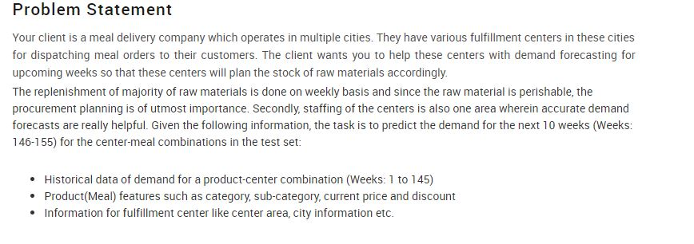
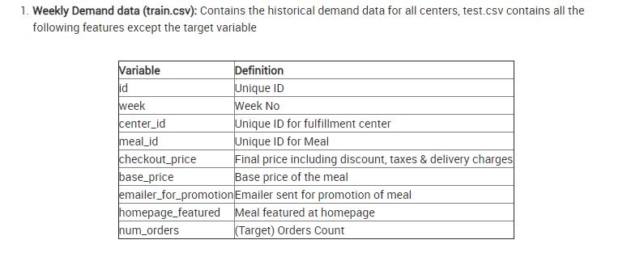
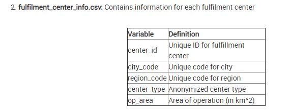
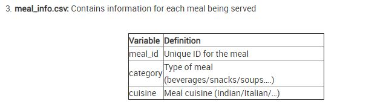

# AV_Demand_Forecasting_challenge

Demand Forecasting for Upcoming weeks based on Pervious weeks .

## Techniques Used:
- Tree based Xgboost ,Catboost to find the pattern with categorical features (through more number of splits )
- Using Categorical embedings to leaverage the power of Dense vectors for categorical features through  Neural Network's Optimizers
